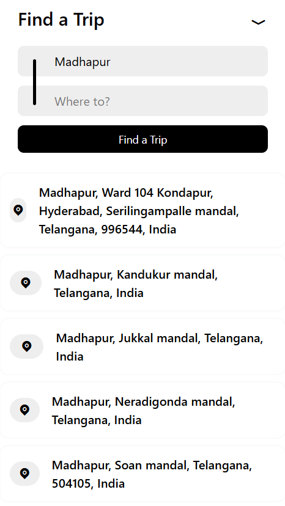
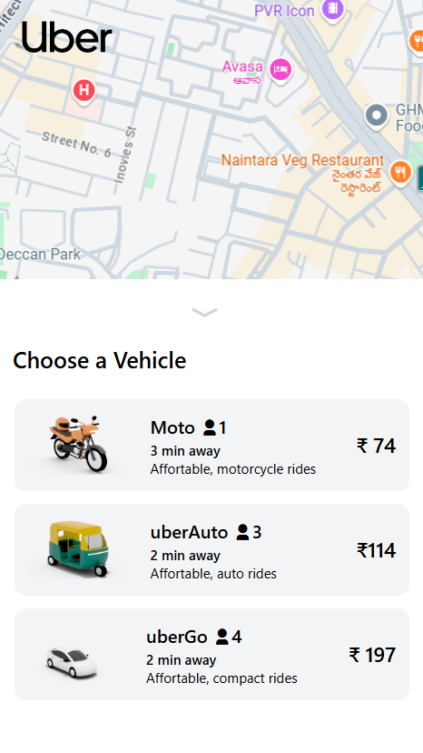
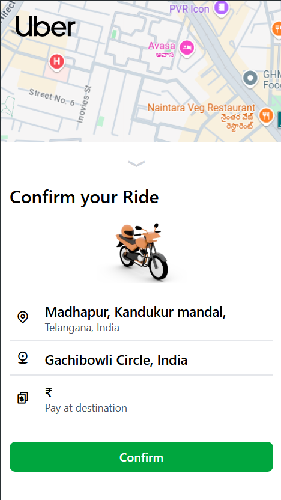
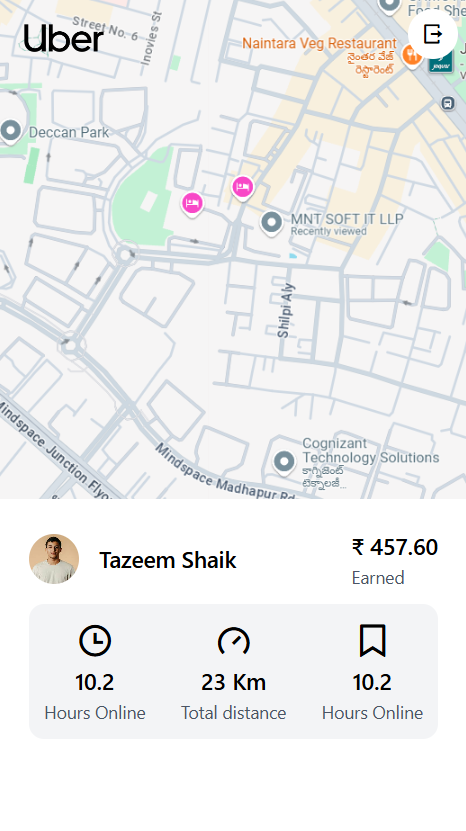
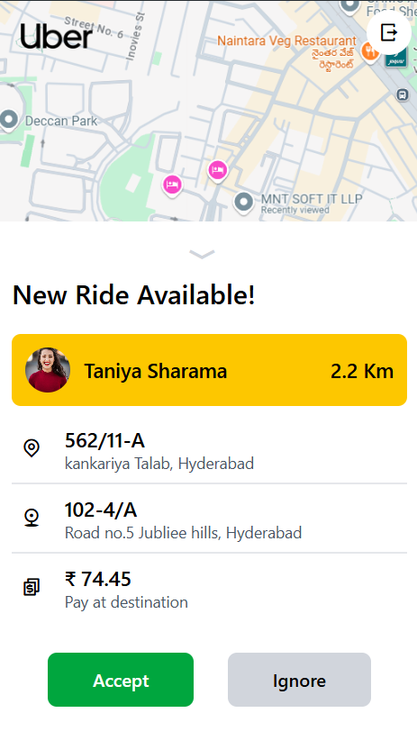
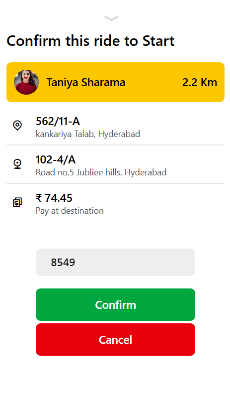

# Uber Clone Project Documentation

## Overview
This project is a ride-hailing application similar to Uber, where users can book rides, and captains (drivers) can accept ride requests. The backend is built using Node.js, express.js and with MongoDB as the database.

## Features
- User and Captain authentication
- Ride booking and status management
- Location-based pickup and drop-off
- Fare calculation based on distance and vehicle type
- Real-time captain availability within a specified radius

## Project Screenshots

### User Screens
<div style="display: flex; justify-content: space-between;">
    
    
    
</div>

### Captain Screens
<div style="display: flex; justify-content: space-between;">
    
    
    
</div>


## Models

### User Model
```javascript
const userSchema = new mongoose.Schema({
    fullname: {
        firstname: {
            type: String,
            required: true,
            minLength: [3, 'First name must be at least 3 characters']
        },
        lastname: {
            type: String,
            minLength: [3, 'Last name must be at least 3 characters']
        }
    },
    email: {
        type: String,
        required: true,
        unique: true,
        minLength: [5, 'Email must be at least 5 characters long']
    },
    password: {
        type: String,
        required: true,
        select: false,
    },
    socketId: {
        type: String
    }
});
```

### Captain Model
```javascript
const captainSchema = new mongoose.Schema({
    fullname: {
        firstname: {
            type: String,
            required: true,
            minLength: [3, 'First name must be at least 3 characters long']
        },
        lastname: {
            type: String,
            minLength: [3, 'Last name must be at least 3 characters long']
        }
    },
    email: {
        type: String,
        required: true,
        unique: true,
        lowercase: true,
    },
    password: {
        type: String,
        required: true,
        select: false,
    },
    socketId: {
        type: String
    },
    status: {
        type: String,
        enum: ['active', 'inactive'],
        default: 'inactive',
    },
    vehicle: {
        color: {
            type: String,
            required: true,
            minLength: [3, 'Color must be at least 3 characters long'],
        },
        plate: {
            type: String,
            required: true,
            minLength: [3, 'Plate must be at least 3 characters long'],
        },
        capacity: {
            type: Number,
            required: true,
            min: [1, 'Capacity must be at least 1']
        },
        vehicleType: {
            type: String,
            required: true,
            enum: ['car', 'moto', 'auto'],
        }
    },
    location: {
        ltd: {
            type: Number,
        },
        lng: {
            type: Number,
        }
    }
});
```

## Location and Pricing API Integration

### Fetching Coordinates from Address
```javascript
module.exports.getAddressCoordinate = async (address) => {
    const apiKey = process.env.LOCATIONIQ_API_KEY;
    const url = `https://us1.locationiq.com/v1/search.php?key=${apiKey}&q=${encodeURIComponent(address)}&format=json`;
    try {
        const response = await axios.get(url);
        if (response.data && response.data.length > 0) {
            const location = response.data[0];
            return {
                ltd: location.lat,
                lng: location.lon,
            };
        } else {
            throw new Error('Unable to fetch coordinates');
        }
    } catch (error) {
        console.error('Error fetching coordinates:', error);
        throw error;
    }
};
```

### Calculating Distance and Duration
```javascript
module.exports.getDistanceTime = async (origin, destination) => {
    if (!origin || !destination) {
        throw new Error('Origin and destination are required');
    }
    const apiKey = process.env.LOCATIONIQ_API_KEY;
    try {
        const originCoords = await module.exports.getAddressCoordinate(origin);
        const destinationCoords = await module.exports.getAddressCoordinate(destination);
        if (!originCoords.ltd || !originCoords.lng || !destinationCoords.ltd || !destinationCoords.lng) {
            throw new Error('Invalid coordinates received');
        }
        const url = `https://us1.locationiq.com/v1/directions/driving/${originCoords.ltd},${originCoords.lng};${destinationCoords.ltd},${destinationCoords.lng}?key=${apiKey}&overview=false`;
        const response = await axios.get(url);
        if (response.data && response.data.routes && response.data.routes.length > 0) {
            const route = response.data.routes[0];
            return {
                duration: route.duration,
                distance: route.distance,
            };
        } else {
            throw new Error("No valid routes found.");
        }
    } catch (err) {
        console.error("Error in getDistanceTime:", err);
        throw err;
    }
};
```

### Finding Captains in the Radius
```javascript
module.exports.getCaptainInTheRadius = async (ltd, lng, radius) => {
    const captains = await captainModel.find({
        location: {
            $geoWithin: {
                $centerSphere: [[ltd, lng], radius / 6371]
            }
        }
    });
    return captains;
};
```


## Conclusion
This project successfully integrates user and captain management, ride booking, real-time location fetching, and pricing calculation. Further improvements can include:
- Implementing WebSocket for real-time ride updates
- Adding payment gateway integration
- Enhancing UI for a better user experience

